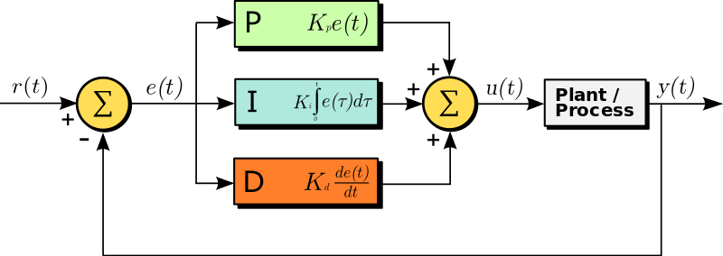

# pidcontrol
A simple PID controller, in python.

See [Wikipedia PID](https://en.wikipedia.org/wiki/Proportional%E2%80%93integral%E2%80%93derivative_controller) for a complete explanation of PID controllers.

## Creating a controller
To create a simple P/I/D (proportional/integral/derivative) controller:

    from pid import PID
    p = PID(Kp=foo, Ki=bar, Kd=baz)

where foo/bar/baz (Kp=/Ki=/Kd=) are the gain constants for the respective control calculations.

## Terminology

Refer to this drawing:

from the Wikipedia PID article.

Attribution: [Arturo Urquizo](https://commons.wikimedia.org/wiki/File:PID.svg), [CC BY-SA 3.0](https://creativecommons.org/licenses/by-sa/3.0/), via Wikimedia Commons

- **controlled-device**: The overall mechanism being controlled. "Plant/Process" in the above picture. It has one input, `u(t)` or the "control variable" and one output, `y(t)` or the "process variable". For example, the control variable might be the position of a valve, and the output variable might be a measured resulting temperature. 
- **process-variable** or `y(t)`: The measured value from the controlled device.
- **setpoint** or `r(t)`: The target ("reference") value for the process-variable.
- **control-variable** or `u(t)`: The value computed by the PID controller and sent to the controlled device.

The units of `u(t)` and `y(t)` are often different; the gain constants Kp/Ki/Kd are therefore application-specific in their general order of magnitude. For example, in an automobile cruise-control application the process variable is the speed in mph. The setpoint, which always has the same units as the process variable, would also be in mph. However, the control variable will be something such as "percentage implied application of the accelerator pedal."

## Picking the gain constants ("tuning")
Choosing reasonable values for Kp/Ki/Kd is critical for proper operation; however, it is highly application-specific and hard to give general advice. Refer to the Wikipedia article for several references to tuning methods.

## Running a control loop
The method `pid` takes two arguments, a current process variable value and a time interval (the delta-t between this pv measurement and prior). In a typical use the interval is constant, so in pseudo-code a common coding idiom is:

    z = PID(Kp=foo, Ki=bar, Kd=baz)     # constants need to be determined
    interval = 0.1                      # 100msec

    loop: execute once every 'interval' seconds:
        pv = ... read process value from the controlled device ...
        cv = z.pid(pv, dt=interval)
        ... send cv to the controlled device ...

## Ti, Td vs Ki, Kd

Support for the `Ti` ("integration time") and `Td` ("derivative time") form of control constants is not provided. If using Ti/Td is preferred, perform this conversion before constructing the PID:

    Ki = Kp / Ti
    Kd = Kp * Td

## Derivative Term Calculation
The PID() class calculates the derivative term based on the change of the process variable, not the change of the computed error (difference between setpoint and process variable). In applications where the setpoint never changes, the two computation methods are identical. In applications where the setpoint can change from time to time, using the computed error results in a one-interval spike (so-called "derivative-kick") in the D calculation; whereas using the process variable instead avoids this kick.

See `PIDPlus` and the `D_DeltaE` PIDModifier class if, for some reason,
it is desirable to use the delta-e calculation instead of delta-pv despite the derivative-kick problem.

## Public Attributes and Methods

- *object*.**initial_conditions(pv=None, setpoint=None)**: Call this to establish initial conditions for the process variable and/or the setpoint. Using this function to establish those initial values will prevent any false "kick" in the control variable signal from an implicitly-spurious instantaneous pv change and/or setpoint change.

- *object*.**setpoint**: Public attribute. The setpoint. Can be set directly any time the desired reference value changes; however, see the `initial_conditions` method for a discussion on how to best set this at startup time.

- *object*.**pid(pv, dt)**: Perform a PID calculation given a current process-variable value and a delta-t (in seconds, floating point) for the interval between calls. Returns the new control-variable (`u(t)`) value.

- *object*.**last_pid**: Public attribute. A tuple containing the last three, unweighted, values for the Proportional ("error"), Integral, and Derivative control variables.

## Simple PID() Example

See pidexample.py for an example. Try running it like this:

   python pidexample.py --Kp=70 --Ti=1.25 --Td=0.5 -n=500

## PID Algorithm Addons: PIDPlus class

The simple PID algorithm works well enough in most use cases. For others, the class `PIDPlus` provides several customizations (called "modifiers") and a framework for adding more.

The following features are available as `PIDPlus` modifiers:

- **Setpoint Ramping**: Any time *object*.setpoint is changed, instead of the change taking effect immediately it will be ramped-in over a configurable time period. In applications where the setpoint does indeed change midstream, this may be useful in reducing or eliminating abrupt control change behavior (especially overshoot).

- **Integration windup protection**: A large setpoint change (or other dynamic conditions) can cause excessive accumulation in the integration term. The excess will persist (and distort control output) until there has been sufficient cumulative time spent with an opposite error. Among other problems, this can cause overshoot and a slower return to the commanded setpoint. This excessive accumulation is (sometimes) called *integral windup*. Windup protection allows an absolute limit to be set on the integration term value, thus limiting the amount of windup possible. Setting this value correctly requires application-specific knowledge; in particular note that low values will limit the control authority range of the integration term (this is both the point, and the peril, of windup limiting).

- **Integration reset and pause**: When the setpoint is changed, it may be desirable to reset the integration term back to zero, and optionally cause the integration accumulation to pause for a little while for the other controls to settle into a steadier state. This is another approach to mitigating the same type of problem that windup protection attempts to solve. This solution is close to emulating a new cold-start of the controller with a new setpoint. Note that in some systems the integration term is, in effect, a dynamically-discovered "bias" value (minimum control value needed for equilibrium). In such systems using this modifier can make things worse, not better; obviously this is application-specific.

- **History Recording**: This modifier doesn't affect any algorithm operation but provides a lookback of controller computations. Can be useful during tuning and debugging.

- **Bang Bang**: This is probably rarely a useful modification; it was implemented primarily as a test of the PIDModifier system to see how far customization features could be pushed. This alters the behavior of the PID controller such that the control variable is always returned as a fully "on" value or a fully "off" value.

- **Use Delta E for derivative**: This changes the algorithm so that the derivative term is computed based on the slope of the error term rather than the slope of the process variable. There is likely no real-world use for this plug-in but it is there so the two approaches can be compared.

## Using PIDPlus with Modifiers

To create a PIDPlus control object, first a list of PIDModifier objects must be set up.  Each PIDModifier object represents a specific behavior modification with specific parameters. These objects are then passed in to PIDPlus along with the standard PID parameters (Kp/Kd/Ki).

Details shown below, but first an example:

    from pid import PIDPlus, PIDHistory
    
    # initialize a PIDHistory 'modifier' with 1000-entry lookback
    h = PIDHistory(1000)
    
    # now make the PIDPlus with this modifier
    # Note in this case there is only one modifier and it can
    # be supplied directly; if there were multiple they can
    # instead be supplied as 'modifiers=[modifier_1, modifier_2, etc]'
    z = PIDPlus(Kp=foo, Ki=bar, Kd=baz, modifiers=h)

    ... do the normal things with z

    # The history collected by PIDHistory is available as an
    # attribute of the PIDHistory object:
    print(h.history)              # for example, to see the record

The specific PIDModifier class names and __init__ signatures are:

### SetpointRamp

Example usage - to cause all modifications of z.setpoint to be ramped in over a period of 1.5 seconds:

    m = SetpointRamp(1.5)

and m must (of course) be given to PIDPlus in the modifiers list.

It is possible to change the ramp time in an active controller by changing the `secs` attribute:

    m.secs = 2.5

would change the ramp time to 2.5 seconds. If a ramping is already in progress when this is done, a new ramp is calculated from the then-current (partly-ramped) setpoint to the already-established target, at a rate dictated by the new ramp time. If the new ramp time is zero, the setpoint is immediately changed to that target.

### Windup Protection

To limit the (unweighted!) integration term to +/- x:

    m = I_Windup(x)

To limit the (unweighted!) integration term to a closed asymmetric range [lo, hi]:

    m = I_Windup((lo, hi))         # NOTE: one tuple arg, not two args

Note that the order in the tuple does not matter; the lower value will be the low limit and the higher value will be the high limit.

### Integration reset and delay on setpoint change

To cause the integration term to be reset to zero on any setpoint change:

    m = I_SetpointReset(0)

This causes the term to be reset, but sets a zero second delay for resumption of integration. To implement a delay of x seconds:

    m = I_SetpointReset(x)

NOTE: There is no way to ONLY implement a delay, without a reset. Though, of course, users can write their own additional PIDModifier subclasses.

### History

This was already shown in the introductory example. The PIDHistory modifier keeps a `deque` (i.e, a FIFO list) of the PIDHookEvent stream which encapsulates all the internal computations and state changes of the PID system. The objects in this record have repr implementations that will print all the relevant variables so these can be sent directly to a logger, for example, if so desired.

To instantiate a history modifier to track the most recent 1000 entries:

    m = PIDHistory(1000)

and the entries will be found in m.history as a `deque` (which could potentially have fewer than N entries if it hasn't been fully populated yet).

### Bang Bang

This one is complicated; quoting from the __init__ signature and doc string:

    def __init__(self, /, *,
                 on_threshold=0, off_threshold=0,
                 on_value=1, off_value=0,
                 dead_value=None):

    Threshold semantics are:
    If the OFF threshold is None and ON not None:
         ON: >= on_threshold
        OFF:  < on_threshold

    If the OFF threshold is not None and ON is None:
         ON:  > off_threshold
        OFF: <= off_threshold

    If both on/off thresholds specified, then:
         ON: >= on_threshold
        OFF: <= off_threshold
       DEAD: > on and < off

It implements a bang-bang controller with an optional middle "dead" zone (which is really a third potential control variable value). It is not likely to be useful but does demonstrate the capabilities of the PIDModifier system.

### D_DeltaE

There are two forms. The simplest is:

    m = D_DeltaE()

There is an option for a 1-interval kick filter which ameliorates derivative-kick on setpoint changes. To request that feature be turned on:

    m = D_DeltaE(kickfilter=True)

### Putting It All Together - PIDPlus with multiple modifiers

Here is a code example for a PIDPlus that uses setpoint ramping, windup limit, and the PIDHistory feature:

    ramp = SetpointRamp(1.5)      # ramp over 1.5 seconds
    windup = I_Windup(4.2)        # limit integration to [-4.2, 4.2]     
    h = PIDHistory(1000)          # keep 1000 history records
    
    z = PIDPlus(Kp=foo, Ki=bar, Kd=baz, modifiers=[ramp, windup, h])

Note that the order of the modifiers in that list is significant: they will be activated in that order each time z.pid() calculates values. This is irrelevant for most of the modifiers; however, it may be important to think about where to put the PIDHistory modifier depending on what it is you are trying to see. The PIDHistory modifier is actually one that can be meaningfully instantiated multiple times, thus:

    ramp = SetpointRamp(1.5)      # ramp over 1.5 seconds
    windup = I_Windup(4.2)        # limit integration to [-4.2, 4.2]     
    h1 = PIDHistory(1000)         # keep 1000 history records
    h2 = PIDHistory(1000)         # also keep 1000 history records
    
    p = PIDPlus(Kp=foo, Ki=bar, Kd=baz, modifiers=[h1, ramp, windup, h2])

In this example, h1.history would have the records from BEFORE the ramp and windup handlers ran; h2.history would have the records from AFTER. Instantiating a PIDPlus with multiple objects of other modifiers (e.g., two SetpointRamp modifiers) is not generally useful (and the exact behavior may be implementation-dependent).

## No Modifiers
Of course a `PIDPlus` can be used with no modifiers:

    p = PIDPlus(Kp=foo, Ki=bar, Kd=baz)

This is perfectly acceptable, it just runs slower than a `PID` does. Performance testing on a typical laptop shows the `pid` method in a `PID` object taking about 0.3 usec per call. The same with `PIDPlus` takes about 11 usec per call (roughly 36 times slower).

## Writing a PIDModifier

A custom PIDModifier interacts with one or more PIDHookEvent notifications by providing a handler method for that notification. There are 6 PIDHookEvent types, each with a specific notification method name as noted here:

- PIDHookAttached: generated at the **end** of PIDPlus.__init__ for each modifier attached to that PIDPlus. PIDModifier method name: `PH_attached` . The significance of this being "at the end of" PIDPlus.__init__ is that the PIDPlus will be fully-initialized when this notification happens.

- PIDHookInitialConditions: generated when the 'initial_conditions()' method is invoked on a PIDPlus object. PIDModifier method name: `PH_initial_conditions` .

- PIDHookSetpoint: generated when the setpoint attribute is set on a PIDPlus object. PIDModifier method name: `PH_setpoint_change` .

- PIDHookPreCalc, PIDHookMidCalc, PIDHookPostCalc: generated at the beginning, middle, and end of the PID calculation. These three spots offer different ways of modifying the PID control calculation. PIDModifier method names: `PH_precalc` , `PH_midcalc` , `PH_postcalc` .

In addition to the specific method names mentioned above,  each notification subclass defines its own 'event' object which will be passed to those handler methods. The specific event objects will be described later.

To create a new modification type, subclass PIDModifier and supply a handler for every event of interest. For example, to create a PIDModifier that will interact with PIDHookSetpoint events and PIDHookMidCalc events:

    class ExampleModification(PIDModifier):
        def PH_setpoint_change(self, event):
            print(f"setpoint change event: {event}")

        def PH_midcalc(self, event):
            print(f"midcalc change event: {event}")

A modification can declare its own __init__ method if it needs additional parameters. Best practice includes using *args/**kwargs and super() to continue the __init__ calls up the subclass chain. So, as a trivial example, to add a 'foo' parameter to the ExampleModification:

    class ExampleModification(PIDModifier):
        def __init__(self, foo, *args, **kwargs):
            super().__init__(*args, **kwargs)
            self.foo = foo

        # and print that name when an event occurs
        def PH_setpoint_change(self, event):
            print(f"setpoint change event: {event}, foo: {foo}")

        def PH_midcalc(self, event):
            print(f"midcalc event: {event}, foo: {foo}")

which is the same as the first example but now includes a 'foo' parameter that presumably would be used for something in a real example.

A PIDModifier can also define a catch-all handler, called `PH_default` . It receives notifications this PIDModifier doesn't otherwise handle explicitly. As an example, here is the complete code for the PIDHistory modifier:

    class PIDHistory(PIDModifier):
        def __init__(self, n, *args, **kwargs):
            super().__init__(*args, **kwargs)
            self.history = deque([], n)

        # this _default method gets all events and stores them
        def PH_default(self, event):
            self.history.append(copy.copy(event))

This works by creating a deque (from collections) in the PIDHistory object, and simply entering (a copy of) every event (caught by `PH_default`) into it. The reason for copying the event is because modifiers further down the chain can alter `event` values. For the purpose of the history modifier the desired semantic is to record the values at the time they were seen by the history module; hence the event is copied.

As will be described next, each event contains its own set of attributes specific to that event. Some of the attributes are read-only, emphasizing that changing them will have no effect on the PIDPlus operation. Others are read-write and changing them will have event-specific semantics as discussed with each event below.

The specific events, and associated semantics, for each PIDHook event are:

**PIDHookAttached**:
Event is generated at the very end of PIDPlus initialization, so the underlying PIDPlus object is "ready to go" when this notification is received. See "Shared Modifiers" discussion for one way to use this event.

READ-ONLY ATTRIBUTES:
- `pid` -- the PIDPlus object

**PIDHookInitialConditions**:
Event is generated AFTER the `initial_conditions()` method has completed modifying the PIDPlus object. The intent of this event is to allow PIDModifier implementations a hook for (re)initializing their own state if the application uses the `initial_conditions` method to change pv and/or the setpoint.

READ-ONLY ATTRIBUTES:
- `pid` -- the PIDPlus object
- `setpoint` -- the `setpoint` argument specified in the corresponding `initial_conditions()` method invocation. NOTE: Can be None (meaning: no setpoint change).
- `pv` -- the `pv`argument; can be None.

Semantic notes: As noted above, this event is generated **after** the initial_conditions method has modified the `pid` object. 

**PIDHookSetpoint**:
Event is generated BEFORE any modifications in the underlying PIDPlus object occur. This gives the handler the opportunity to affect the setpoint change.

There is one read/write attribute and the rest are read-only.

READ-WRITE ATTRIBUTES:
- `sp_now` -- If the handler sets this attribute to something other than None (its default), then this value is used to set the setpoint.

READ-ONLY ATTRIBUTES:
- `pid` -- the PIDPlus object
- `sp_prev` -- the setpoint value prior to any modification.
- `sp_set` -- the setpoint value that was requested to be set by the application (see discussion below). 

Semantic notes: As noted above, this event is generate **before** the assignment to the setpoint attribute. This allows handlers to change the value that gets assigned, by setting `sp_now` to something other than `sp_set` (`sp_set` itself is read-only)

As a trivial example:

    class SetpointPercent(PIDModifier):
        def PH_setpoint_change(self, event):
            event.sp_now = event.sp_set / 100

This would allow users to use "percentages" for the setpoint, e.g.:

    z = PIDPlus(Kp=1, modifiers=SetpointPercent())
    z.setpoint = 50
    print(z.setpoint)

This will print 0.50 as the resulting setpoint (whether it is a good idea to implement something like this is up for debate, but it's a simple example). Another example later will show another (better) way to accomplish this without the mismatch between written and read .setpoint values.

**PIDHookPreCalc**:
This event is generated at the very beginning of the PID calculation (as a result of the `.pid()` method being invoked). It contains 1 read-only attribute and 5 read-write attributes:

READ-WRITE ATTRIBUTES:
- `e` -- the error value to use. Default: None.
- `p` -- the (unweighted) proportional term value to use. Default: None.
- `i` -- the (unweighted) integral term value to use. Default: None.
- `d` -- the (unweighted) derivative term value to use. Default: None
- `u` -- the control value to ultimately return. Default: None

READ-ONLY ATTRIBUTES:
- `pid` -- the PIDPlus object

Semantic notes: throughout the three pre/mid/post calculation events, any time one of the five attributes `e`, `p`, `i`, `d`, and `u` are set to something other than None, they become the value for that parameter and will NOT be overwritten by the PIDPlus code from that point on in this iteration of the `pid()` calculation. Note, however, that they can certainly be overwritten by other modifiers further down the list if there are multiple modifiers in this PIDPlus.

Consider this trivial example:

    class UBash(PIDModifier):
        def PH_precalc(self, event):
            event.u = .666

    z = PIDPlus(Kp=1, modifiers=UBash())
    print(z.pid(0, dt=0.01)

This will print 0.666 even though the control variable would otherwise normally be calculated to be "0" in this situation as the pv is equal to the (default) setpoint and only Kp is non-zero.

Bashing `u` this early in the sequence is unlikely to be useful, but later in the sequence (i.e, in a postcalc handler) `u` could be usefully modified if it were necessary to restrict the range of it under certain conditions.

Here is a better way to implement "setpoint as a percent" ... this precalc modifier sets the `e` value, which is normally computed as:

    e = setpoint - pv

but this overrides it as shown, to allow the setpoint to be scaled up by 100 (i.e., expressed as a percent) in the attribute, but be treated as a value between 0 and 1 in the error term calculation:

    class SetpointPercent(PIDModifier):
        def PH_precalc(self, event):
            event.e = (event.pid.setpoint / 100) - event.pid.pv

The underlying PIDPlus code only uses the setpoint in the `e` calculation, so by doing this calculation here the setpoint can be treated as scaled by 100.

**PIDHookMidCalc**:
After the precalc events are handled, the PIDPlus code fills in values for e/p/i/d (but not u) for any attribute not provided by any precalc handler and then generates a MidCalc event.

READ-WRITE ATTRIBUTES:
- `e` -- the current candidate error value. Will NEVER be None.
- `p` -- the current candidate (unweighted) proportional term value. NEVER None.
- `i` -- the current (unweighted) candidate integral term value. NEVER None.
- `d` -- the current (unweighted) candidate derivative term value. NEVER None.
- `u` -- the control value to ultimately return. Default: None

READ-ONLY ATTRIBUTES:
- `pid` -- the PIDPlus object

Essentially this gives handlers of this event a second swing at the parameters, including the default values that the unmodified behavior would calculate anyway, with the exception of `u` (only visible in the postcalc event). A midcalc handler can still bash `u` here if it wants to override what would otherwise be the weighted combination of the given p/i/d values here.

**PIDHookPostCalc**:
The last of the three events during `.pid()` calculation. At this stage a candidate `u` value has been computed from the p/i/d terms. Only the `u` value can be overridden at this stage; the remaining attributes are read-only.

READ-WRITE ATTRIBUTES:
- `u` -- the candidate control value to ultimately return. Will NEVER be None.

READ-ONLY ATTRIBUTES:
- `pid` -- the PIDPlus object
- `e` -- for reference: the error value. NEVER None.
- `p` -- for reference: the (unweighted) proportional term value. NEVER None.
- `i` -- for reference: the (unweighted) integral term value. NEVER None.
- `d` -- for reference: the (unweighted) derivative term value. NEVER None.

## Shared Modifiers
Some modifiers can be meaningfully shared among multiple PIDPlus controllers, because they have no implicit/internal state. An good example is `I_Windup` which simply performs a (stateless) calculation on the integration value it is supplied via a notification event.

Some modifiers have state but still can be meaningfully shared; a good example is the PIDHistory modifier. If a single PIDHistory is attached to multiple PIDPlus control objects, the history will contain an interwoven list of events (each which will have the .pid attribute to disambiguate which controller it came from).

Some modifiers cannot be meaningfully shared because they have controller-specific internal state. The SetpointRamp modifier is a good example of this. Such modifiers should generally be coded to raise an exception if sharing is attempted. The `PH_attached` notification can be used for this; here is a trivial example that is a no-op but does not allow itself to be attached more than once:

    class AttachToJustOne(PIDModifier):
        def PH_attached(self, event):
            try:
                if self.__attached_to != event.pid:
                    raise TypeError("multiple attachment attempted")
            except AttributeError:
                self.__attached_to = event.pid

